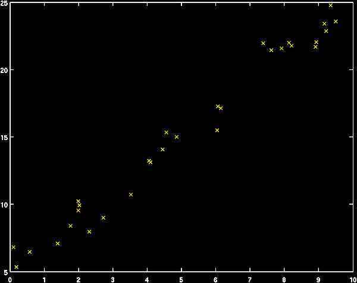

### 1. Linear Regression
Linear regression is the method for representing observed outputs as linear
combinations of functions of the inputs. The "linear" in linear regression refers to
the mixing weights on the functions of the inputs, not on the form of the functions.
This is called in machine learning jargon “supervised learning”.

&nbsp;&nbsp;&nbsp;&nbsp;
Supervised learning is a type of machine learning algorithm that uses a known
dataset (called the training dataset) to make **predictions.** The **training dataset**
includes **input data** and **response values.** From it, the supervised learning
algorithm seeks to build a model that can make predictions of the response values
for a new dataset. A **test dataset** is often used to **validate** the model. Using larger
training datasets often yield models with higher predictive power that can generalize
well for new datasets.


The simplest form of linear regression is the well-known case of fitting a trend line
to data that appears to have a linear relationship. Consider the following data:

9.50129 23.57002

2.31139 7.95719

6.06843 17.26218

4.85982 15.00733

8.91299 21.67951

7.62097 21.43285

4.56468 15.31852

0.18504 5.33244

8.21407 21.75544

4.44703 14.06871

6.15432 17.12194

7.91937 21.56453

9.21813 22.84794

7.38207 21.94733

1.76266 8.38893

4.05706 13.22806

9.35470 24.77616

9.16904 23.39737

4.10270 13.10976

8.93650 22.04064

0.57891 6.45224

3.52868 10.72118

8.13166 21.97765

0.09861 6.82079

1.38891 7.08604

2.02765 9.91330

1.98722 10.22844

6.03792 15.48212

2.72188 9.00279

1.98814 9.54743


&nbsp;&nbsp;&nbsp;&nbsp;&nbsp;&nbsp;&nbsp;&nbsp;&nbsp;&nbsp;&nbsp;&nbsp;&nbsp;&nbsp;&nbsp;&nbsp;&nbsp;&nbsp;&nbsp;&nbsp;&nbsp;&nbsp;&nbsp;&nbsp;&nbsp;&nbsp;&nbsp;&nbsp;&nbsp;&nbsp;&nbsp;&nbsp;&nbsp;&nbsp;&nbsp;&nbsp;&nbsp;&nbsp;&nbsp;&nbsp;&nbsp;&nbsp;&nbsp;&nbsp;&nbsp;&nbsp;&nbsp;&nbsp;&nbsp;&nbsp;&nbsp;&nbsp;&nbsp;&nbsp;&nbsp;&nbsp;&nbsp;&nbsp;&nbsp;&nbsp; Plot of the above data

  
 
Visual inspection indicates that the relationship between the inputs (x-axis) and theoutputs (y-axis) is linear. So, we want to find a function in the form of a line that fits
the data:

$$\hat y= b + mx$$
The regression problem here is to find the constants _m_ and _b_ such that the value
of ŷ for a given x is, on average, close to the observed value of y.
We can frame this problem more generally by realizing that the formula for a line
(equation 1) represents y as a 1st order polynomial of x. We can write this formally
as:

$$\hat y= w_{0}φ_{0}(x) + w_{1}φ_{1}(x) = \sum_{i=0}^{1} w_iφ_i(x) $$
where
$$ w1 = m; φ_1(x) = x^1 = x; w_0 = b; φ_0(x) = x^0 = 1$$
In this form, ŷ is clearly a linear combination of functions of x. (Note that the
functions of x, e.g. φ j (x), are called **basis functions**. The rather trivial basis
function φ0(x)=1 is usually called the "bias" or "DC bias". We can conveniently
represent equation 2 for the whole dataset as a linear equation of matrices and
vectors:
$$ w_{0}φ_{0}(x[1]) + w_{1}φ_{1}(x[1]) = y[1] $$
$$ w_{0}φ_{0}(x[2]) + w_{1}φ_{1}(x[2]) = y[2] $$
$$ w_{0}φ_{0}(x[n]) + w_{1}φ_{1}(x[n]) = y[n] $$
which we can write as a matrix multiplication:
$$
\left(\begin{array}{cc} 
φ_0(x[1]φ_1(x[1])\\
φ_0(x[2]φ_1(x[2])\\
\vdots\\
φ_0(x[n]φ_1(x[n])
\end{array}\right)
\left(\begin{array}{cc} 
w_0\\ 
w_1
\end{array}\right)
=
\left(\begin{array}{cc} 
y[1]\\
y[2]\\
\vdots\\
y[n]
\end{array}\right)
$$ 
or more succintly,
$$ Φw = y $$
Note that the columns of **Φ** are the basis functions applied to x (we leave off the
functional indication for notational efficiency), and the vector w specifies how to
linearly combine the basis functions of x to produce y. You may recognize this as a
simple system of linear equations. However, there is a problem: the number of
unknowns, the w's, is 2, but the number of equations is the number of data points, n.
With more equations than unknowns, this is an **overdetermined** system of
equations. If this system of equations were not overdetermined, the solution would
be simply:
$$ w = Φ^{-1}y $$
However, because Φ is not square, we can not invert it. Instead, we must set up an
optimization problem to find the best approximate solution for w. To to this, we
must define what we mean by "best". For linear regression, the most common
definition of **"best" is "best in a least square sense"**, meaning that we want to
minimize the sum of squares error:

$$ E =  \sum_{i=1}^{n} (\hat y[i]-y[i])^{2}) $$
where
$$ \hat y[i] = \sum_{j=0}^{1} w_jφ_j(x[i]) $$
Using matrix notation,
$$ E = (Φw-y)^{T}(Φw-y) $$
We can find this solution using the standard approach of finding the stationary point
where:
$$
\nabla _wE=0 \\
\nabla_w[(Φw-y)^{T}(Φw-y)] = 0 \\
\nabla_w[w^TΦ^TΦw-y^ΤΦw-w^TΦ^Τy+y^Ty] = 0 \\
2Φ^TΦw-2Φ^Ty=0
$$
which yields
$$ w= (Φ^TΦ)^{-1}Φ^Τy $$
Note that equation 4 is very similar in form to equation 3, with the product
$$(Φ^{T}Φ)^{-1}Φ^{Τ}$$
appearing in equation 4 where the inverse of the phi matrix, Φ^-1 appearsin equation 3. We could not actually invert Φ because it was not square (the system
was overdetermined), but by solving the above optimization problem, we have
found the best approximation of the inverse in the least-squares sense. This
approximation is called the **pseudoinverse** or **Moore-Penrose pseudoinverse** and
is notated as:
$$ Φ^{\dagger} = (Φ^ΤΦ)^{-1}Φ^Τ $$
We can now write the solution to any linear regression problem as:
$$ w = Φ^{\dagger}y $$
Returning to the example given at the top, we can perform the regression using
MATLAB’s **pinv** command:
```
load -ASCII 'C:\Users\elias\Dropbox\S3\DataMining\ex1_data.mat';
x=ex1_data(:,1);y=ex1_data(:,2);
phi=[x.^(0) x.^(1)];
w=pinv(phi)*y
plot(x,y,'x');
hold on;
[Y,I]=sort(x);
plot(x(I),phi(I,:)*w,'g');

w =
5.0988
1.9975
```

 

### 2. R square test

The goodness of the least square fit or the strength of the association of the two
variables is determined by the correlation coefficient r which is given by the formula

$$ \frac{ \sum(x_i-\bar{x})(y_i-\bar y)}{\sqrt {\sum(x_i-\bar{x})^2(y_i-\bar y)}^2} $$
Where x and y are the mean values of the coordinates of the given data. If the
variables are increasing together then r-> +1 , if one decreases as other increases
then r->-1 and if r = 0 then they do not relate to each other.

```{r}
# Init environment and read data
library("MASS")
data = read.table("data.txt")
data = as.matrix(data)

dimensions = dim(data) 
```

**Exercise 1: Write an R script to implement the above method and run it for the data given. Apply the R square test and discuss the goodness of the approximation.**
```{r}
source("./scripts/least_square_algorithm.R", local=environment())
```

#### Discussion of results :

By watching the plot above, we can see that the single linear regression of the least squares numerical method *does not give us such a good approximation* for this kind of data.
Specifically, watching the green line, we can see that it is close to 3 or 4 points of data, while the majority of them is definitely out of the way.
**Reminder**: This does not mean that the method is not good for regression. The approximation depends heavily on the data input. (Remember 'garbabe in, garbage out'?)
This also can be verified by seeing the value of the R-Square test.
The 'r' value is *very* close to zero(0) , meaning the the variables do not relate so much to each other.

# Square Test
```{r}
source("./scripts/multiple_Rsquare.R", local=environment())
```
## 3. Linear Regression and Data Mining Problems
## 3.1 The Approach to Data Mining Problems
The process of simple regression follows the same pattern of most data-
mining and pattern recognition techniques. We now consider more closely the
process we followed in the first example.


  * First, we observed the data and decided on a representative model. In
the example, we decided to use a simple linear model. The process of
deciding on a particular model is called **model selection.** A model will
have a set of parameters called **model parameters** which can be
adjusted. In the example, the model parameters were the weights.
  * After selecting a model, we defined a measure of error between our
model's result and the truth. In the example, the error was the sum-of-
squares error. This measure is called a **loss function.**
  * After selecting a model and defining a loss function, we formulated an
optimization problem to find the model parameters (e.g., the weights)
that minimize the value of the loss function. Solving this optimization
problem is called **model fitting.** In the example, we found the
minimum analytically by solving for the stationary point of the loss
function with respect to the weights. In general, data mining problems
do not have simple analytic solutions, and finding efficient algorithms
for model fitting is a fundamental pursuit.


In summary, the central approach to data mining problems is:
  1. Define the model.
  2. Define the loss function.
  3. Decide how to minimize the loss function given the model.
  
### 3.2 Generalization and Evaluation
It is also important to consider our motivation for fitting a model to data. In the case
of regression, we may just desire a simple functional explanation of noisy
observations or to reduce the information given by the data to a single function.
However, often, we intend to use the model for prediction of future outputs from
inputs. A model's ability to accurately predict outputs for future inputs is
called **generalization.**


In order to determine how well the model will generalize to future data generated by
the same process, we can hold out some of the data that we used to fit the model and
use it to test the model. The set that we hold out we call the **test set**, and the set we
use to train the model we call the **training set**. A commonly used split it to use 80%
of the data for the training set, and the remaining 20% for the test set.

```
load -ASCII 'C:\Users\elias\Dropbox\S3\DataMining\ex1_data.mat';
tmp = rand(1,size(ex1_data,1)); % assign a random number to each data point
[Y,I]=sort(tmp); % sort those random numbers
test_set_indices=I(1:floor(size(ex1_data)*0.2)); % assign the first 20% to
test
training_set_indices=setdiff(I,test_set_indices); % and the rest to train
training_set=ex1_data(training_set_indices,:);
test_set=ex1_data(test_set_indices,:);
x_test = test_set(:,1);
y_test = test_set(:,2);
x_train = training_set(:,1);
y_train = training_set(:,2);
phi_train=[x_train.^(0) x_train.^(1)]; % do the regression
w=pinv(phi_train)*y_train;
%Now we have learned the weights from the training data.
%We need to determine how well these learned weights work for
%the unseen test set points.
phi_test = [x_test.^(0) x_test.^(1)]; % form the matrix of basis functions
y_test_predicted = phi_test*w; % find the estimates of y_test
[Y,I]=sort(x_test);
plot(x_test(I),y_test(I),'x');
hold on;
plot(x_test(I),y_test_predicted(I),'g');
```

 


By inspection, the fit on the test points appears to be quite good. We can compute
the mean-square-error (MSE) explicitly for the test set:

```
sum((y_test-y_test_predicted).^2)/length(y_test)
ans = 0.7587
```
How do we decide if this is a good score (note that your result may vary)? Let's
compare to the MSE on the training set:
```
sum((y_train - phi_train*w).^2)/length(y_train)
ans = 0.8772
```

*Exercise 2: Write an R script to implement the above methodology and apply it to the data given.*


The MSE on the test set is nearly equivalent to the MSE on the training set,
indicating that the weights learned on the the training set do generalize well. We
would thus expect that, assuming that whatever process generated our training
observations generates future points, the parameters we learned from the training set
will allow us to make good predictions of the targets (the unobserved values; the y's)
from the features (the observed values; the x's).

#### Discussion of results : 
In the console, we can see that the MSE for test points and the training points is **huge**. The smaller the mean-squared-error, the closer we are to finding the line of best fit with the use of Least Squares Approximation. This verifies once again that our data set input is not that good. 

```{r}
source("./scripts/generalization.R", local=environment())
```

**3.3. Cross-validation** provides a framework for creating several train/test splits and
guaranteeing that each data point is in the test set at least once. The procedure is
simple:
  1. split the data into n equal-sized groups
  2. for i=1 to n,
  (a) select group i to be the test set and all other (n-1) groups to be the training set
  (b) train the model on the training set and evaluate on the test set
  
  
Each iteration is called a **fold**. In general practice, setting n=10 ("10-fold cross
validation") is accepted as giving a highly accurate estimate of the generalization
error of a model. However, since 10 folds means retraining the models 10 times, 10-
fold cross validation may be computationally expensive for large and/or complicated
data sets. In such cases, 5-fold cross validation, or 10-fold cross validation run on a
subset may be appropriate.


Returning to our simple linear regression example, let's implement a cross-
validation framework for evaluating our model's generalizability. Pseudocode for
this would be:


  1. Split the available data into n equal-sized partitions.
  2. for i=1 to n,
    (a) test_set =
    
    
To split the data into equal-sized folds, we can use matlab's uniform random number
generator, **rand**. This function returns numbers from a uniform distribution between
0 and 1. For

```
function
split_assignments=cross_val_split(number_of_folds,number
_of_data_points)
% function
split_assignments=cross_val_split(number_of_folds,number
_of_data_points)
%
% returns an n x s cross-validation assignment matrix
for
% n = number_of_data points
% s = number_of_splits
%
% initialize the split assignment matrix
split_assignments=zeros(number_of_data_points,number_of_
folds);
% assign a random number to each data point
tmp = rand(1,number_of_data_points);
% sort the random numbers
[Y,I]=sort(tmp);
% set the starting point of the first group
group_start=1;
% iterate through the folds
for i=1:1:number_of_folds
clear test_set_indices;
% calculate the end of this group
group_end =
round(i*number_of_data_points/number_of_folds);
test_set_indices = I(group_start:group_end);
% make the start of the next group 1 past the
% end of this group
group_start=group_end+1;
split_assignments(test_set_indices,i)=1;
end
```

Now, using the *cross_val_split* function, we write a script to easily run a ten-fold
cross validation (save the following script into a file called
"regression_ten_fold_cv.m" in your matlab directory):

```
load ex1_data;
split_assignments =
cross_val_split(10,size(ex1_data,1));
for i=1:1:10
training_set =
ex1_data(find(split_assignments(:,i)==0),:);
test_set =
ex1_data(find(split_assignments(:,i)==1),:);
% determine weights from the training set
phi_train=[training_set(:,1).^(0)
training_set(:,1).^(1)];
w=pinv(phi_train)*training_set(:,2);
phi_test=[test_set(:,1).^(0) test_set(:,1).^(1)];
% apply learned weights to the test set and compute
MSE
MSE(i)=sum((test_set(:,2)-
phi_test*w).^2)/size(test_set,1);
end
```

*Now run the script:*

```
regression_ten_fold_cv;

mean(MSE)
ans =
1.0922

std(MSE)
ans =
0.6109
```

*We also can visualize the MSE's as a bar chart:*
```
bar(MSE);
```

 

Note that for this data set, the variance among folds is fairly high. This is because
the data set is small - only 30 points. Each fold is evaluated on a test set of size 3,
therefore individual outlying points have a large influence on the fold's MSE. Folds'
scores generally become more consistant as the number of points in the data set
increases.

**Exercise 3: Implement the cross-validation methodology in R for the given data.**
**3. Recursive Least Squares**
```{r}
source("./scripts/cross_validation.R", local=environment())
```

#### Discussion of results :
We got our data set. We are going to split it to 8(n=8) equal-sized groups.
Each time we are going to keep the group i to be the test set, and the remaining 7(n-1) groups to be the training set.
Then, we are going to train the model and evaluate it for each group.
This is going to happen for 8 times-8 folds.
By watching the result of the plot, we can understand that group number 2 and group number 8 are the 'worst' sets since they have the biggest MSEs
(Reminder: Definition of MSE in the previous exercise)
With the same way, we can see that group number 7 gives us the best results for our model to be trained, then group no.1, etc.

In many data analysis tasks data are not available all at once but arrive sequentially.
Think for example to data collected from sensors, financial time series or adaptive
control applications. In this cases it is useful not to restart from scratch the model
estimation but simply to update the model on the basis of the newly collected data.
One appealing feature of least-squares estimates is that they can be updated at a
lower cost than their batch counterpart. A description of the recursive least squares
method in presented in the book Appl ied Numerical Methods using Matlab, pg 76 by
Yang, et.al. and the matlab code that implements it. The related material is
included in the project 1 file.


**Exercise 4**: 1) Implement the RLS method in R and apply to the 80% of the data
given and use a loop to apply it to the rest of 20% of the points and 2) The
formulation of the method and an R script are given in https://www.otexts.org/1582.
The R script lin_rls.R given in this site applies the RLS fitting to a nonlinear
univariate function. The simulation shows how the fitting evolves as long as data x i ,
y i for _i=1,...,N_ are collected. Run the R script given below which was copied from
the above site.
```
## script lin_rls.R
##
rm(list=ls())
par(ask=TRUE)
n<-1;
rls<-function(x,y,t,P,mu=1){
    P.new <-(P-(P%*%x%*%x%*%P)/as.numeric(1+x%*%P%*%x))/mu
    ga <- P.new%*%x
    epsi <- y-x%*%t
    t.new<-t+ga*as.numeric(epsi)
    list(t.new,P.new)
}
X<-seq(-pi,pi,by=.02)
N<-length(X)
y<-sin(X)+0.1*rnorm(N)
t<-numeric(2)
P<-500*diag(n+1)
mu<-0.9
for (i in 1:N){
    rls.step<-rls(c(1, X[i]),y[i],t,P,mu)
    t<-rls.step[[1]]
    P<-rls.step[[2]]
    plot(X[1:i],y[1:i],
        xlim=c(-4,4),
        ylim=c(-2,2),
        main=paste("Forgetting factor mu<-",mu))
        lines(X[1:i],cbind(array(1,c(i,1)), X[1:i])%*%t,
        col="red",
    )
}
```

```{r}
source("./scripts/rls.R", local=environment())
```

*Appendix A: Matrix Algebra in R*
Most of the methods on this website actually describe the programming of matrices. It
is built deeply into the R language. This section will simply cover operators and
functions specifically suited to linear algebra. Before proceeding you many want to
review the sections on Data Types and Operators.

| Operator or Function        	| Description                                                                                                                                        	|
|-----------------------------	|----------------------------------------------------------------------------------------------------------------------------------------------------	|
| A * B                       	| Element-wise multiplication                                                                                                                        	|
| A %*% B                     	| Matrix multiplication                                                                                                                              	|
| A &o%B                      	| Outer product. AB'                                                                                                                                 	|
| crossprod(A,b) crossprod(A) 	| A'B and A'A respectively                                                                                                                           	|
| t(A)                        	| Transpose                                                                                                                                          	|
| diag(x)                     	| Creates diagonal matrix with elements of x in the principal diagonal                                                                               	|
| diag(A)                     	| Returns a vector containing the elements of the principal diagonal                                                                                 	|
| diag(k)                     	| If k is a scalar, this creates a kx k identity matrix. Go figure.                                                                                  	|
| solve(A,b)                  	| Returns vector x is the equation b = Ax (i.e. , A^-1b)                                                                                             	|
| solve(A)                    	| Inverse of A where A is a square matrix.                                                                                                           	|
| ginv(A)                     	| Moore-Penrose Generalized Inverse of A. ginv(A) requires loading the MASS package.                                                                 	|
| y<-eigen(A)                 	| y$val are the eigenvalues of A                                                                                                                     	|
|                               | y$vec are the eigenvectors of A                                                                                                                     |
| y<-svd(A)                   	| Single value decomposition of A.                                                                                                                    |
|                               | y$d = vector containing the singular values of A                                                                                                    | |                               | y$u = matrix with columns contain the left singular vectors of A 	                                                                                  |
| R <- chol(A)                	| Choleski factorization of A. Returns the upper triangular factor, such that R'R = A.                                                               	|
| y<- qr(A)                    	| QR decomposition of A. y$qr has an upper triangle that contains the decomposition and a lower triangle that contains infromation on the ..        	|
|                             	| Q decomposition of A.                                                                                                                               |
|                               | y$rank is tha rank of A.                                                                                                                            | |                               | y$qraux a vector which contains additional information on Q     	                                                                                  |
|                               | y$pivot contains information on the pivoting strategy used.                                                                                         |
| R <- chol(A)                	| Choleski factorization of A. Returns the upper triangular factor, such that R'R = A.                                                               	|
| cbind( A,B,...)               | Combine matrices(vectors) horizontally. Returns a matrix.                                                                                         	|
| rbind(A,B,...)              	| Combine matrices(vectors) vertically. Returns a matrix.                                                                                           	|
| rowMeans(A)                  	| Returns vector of row means.                                                                                                                        |
| rowSums(A)                  	| Returns vector of row sums.                                                                                                                       	|
| colMeans(A)                   | Returns vector of column means.                                                                                                                    	|
| colSums(A)                   	| Returns vector of column sums.                                                                                                                    	|
